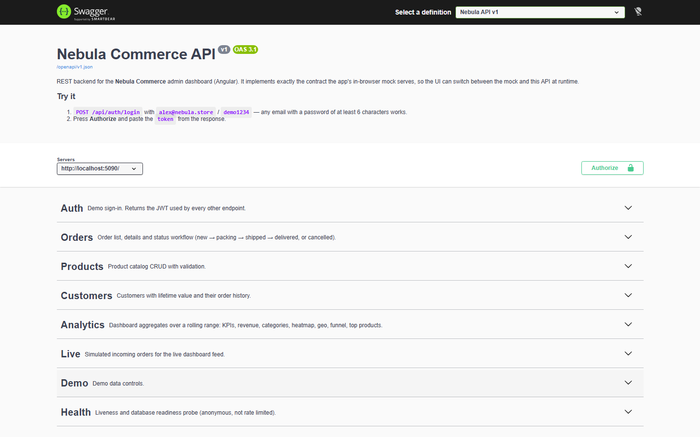
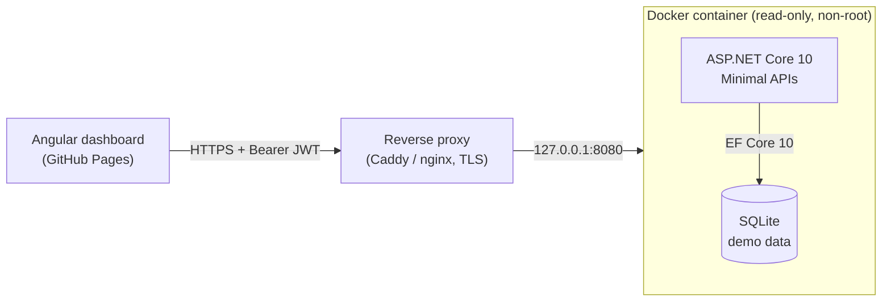
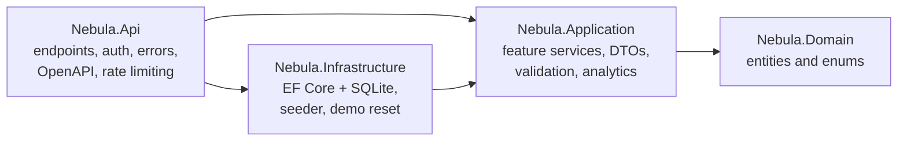
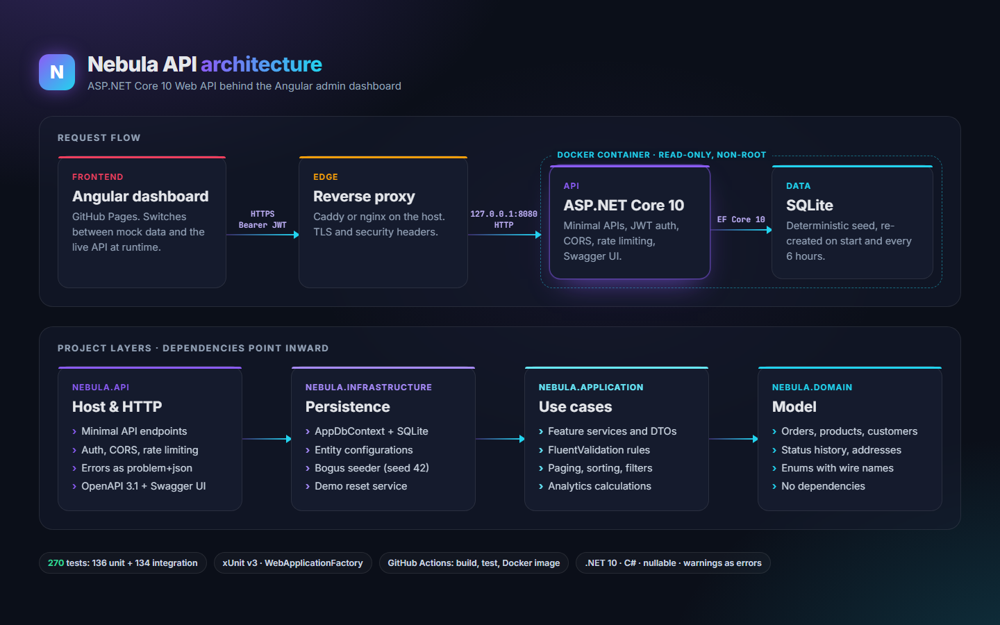
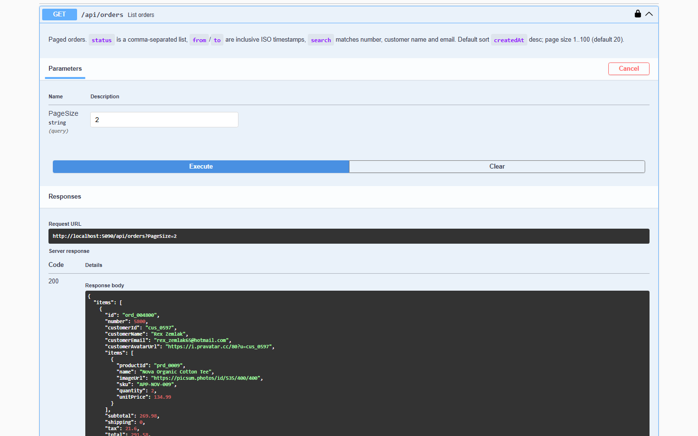
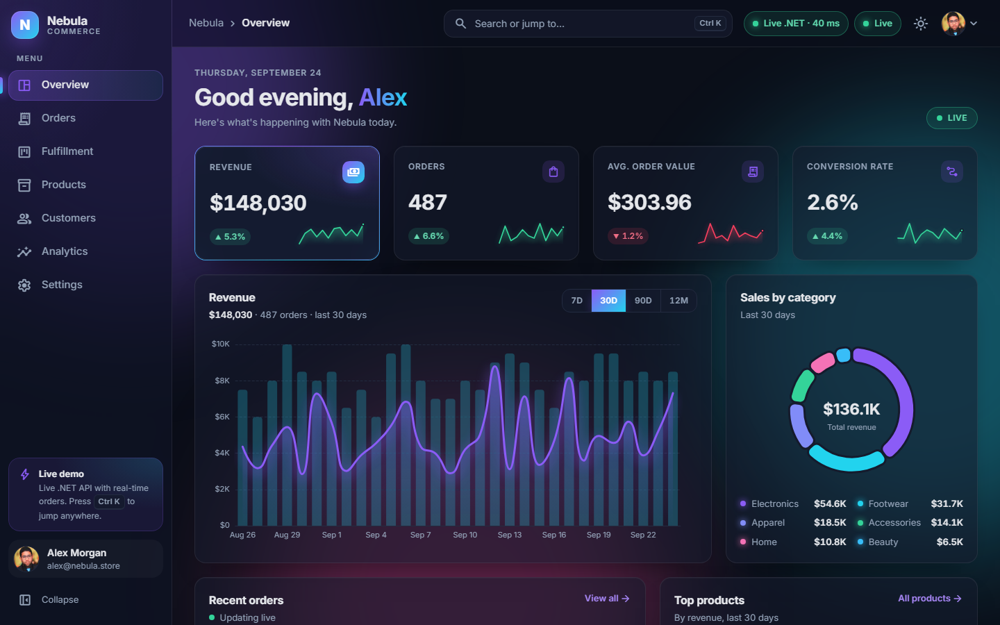

# Nebula API

An ASP.NET Core 10 Web API for the [Nebula Commerce](https://github.com/antryas/nebula-commerce)
admin dashboard (Angular): orders, products, customers, analytics and a live order feed, stored in
SQLite through EF Core. It implements the exact REST contract of the dashboard's in-browser mock,
so the Angular app can switch from demo data to this real backend at runtime.

[](https://github.com/antryas/nebula-api/actions/workflows/ci.yml)


**Live demo:** [Swagger UI](https://api.antrias.site/swagger) ·
[Angular dashboard](https://antryas.github.io/nebula-commerce/) (open the **Mock data** pill in the
top bar and turn on **Live .NET backend**) · Demo account: `alex@nebula.store` / `demo1234`



## Features

- **21 endpoints** under `/api` plus `/health`: sign-in, orders with a status workflow and bulk updates, product
  CRUD with validation, customers with lifetime value, seven analytics reports, a live order feed
  and a demo reset.
- **Same behavior as the frontend mock:** paging, sorting, search and filters, analytics maths,
  error codes and messages were ported from the Angular mock and are locked by contract tests.
- **Clean Architecture without ceremony:** four small projects (Domain, Application,
  Infrastructure, Api), Minimal APIs with route groups and `TypedResults`, plain services.
  No MediatR, AutoMapper or generic repositories.
- **One error format:** every error is `application/problem+json` with a stable `code`,
  a readable `message` and field `details` for validation errors.
- **Security basics:** JWT bearer auth, CORS allow-list, rate limiting per client IP, 64 KB
  request body limit, no `Server` header, exceptions logged but never returned.
- **Documented:** OpenAPI 3.1 document with summaries, examples and the bearer scheme;
  Swagger UI with an **Authorize** button.
- **Deterministic demo data:** 60 products, 700 customers and 4,800 orders generated with Bogus
  (seed 42), re-created on start and every 6 hours.
- **Tested and shipped:** 270 xUnit tests, GitHub Actions (build, test, coverage, Docker build),
  a small hardened container image published to GHCR.

## Architecture

Request flow in production:



Project dependencies point inward:





Why it is built this way (and what was left out on purpose): [docs/architecture.md](docs/architecture.md).

## Endpoints

All `/api` endpoints except sign-in need `Authorization: Bearer <token>`.

| Method | Path | Description |
| --- | --- | --- |
| POST | `/api/auth/login` | Sign in, returns `{ token, user }` |
| GET | `/api/orders` | Paged list: `page`, `pageSize`, `sort`, `dir`, `status`, `search`, `from`, `to` |
| GET | `/api/orders/{id}` | Order with items, address and status history |
| PATCH | `/api/orders/{id}/status` | Change status (`new → packing → shipped → delivered`, or `cancelled`) |
| POST | `/api/orders/bulk-status` | Change the status of several orders |
| GET | `/api/products` | Paged list: `category`, `stock`, `search`, sorting |
| GET | `/api/products/{id}` | One product |
| POST | `/api/products` | Create (201), validated |
| PUT | `/api/products/{id}` | Update, validated |
| DELETE | `/api/products/{id}` | Delete (204) |
| GET | `/api/customers` | Paged list with search and sorting |
| GET | `/api/customers/{id}` | Customer with their orders |
| GET | `/api/analytics/overview` | KPI cards with trend deltas |
| GET | `/api/analytics/revenue` | Revenue and orders over time |
| GET | `/api/analytics/categories` | Sales by category |
| GET | `/api/analytics/heatmap` | Orders by weekday and hour |
| GET | `/api/analytics/geo` | Sales by country |
| GET | `/api/analytics/funnel` | Conversion funnel |
| GET | `/api/analytics/top-products` | Best sellers (`limit` 1–50) |
| POST | `/api/live/tick` | Create a random new order (live feed) |
| POST | `/api/demo/reset` | Re-seed the demo database (204) |
| GET | `/health` | Health check (no auth, not rate limited) |

Analytics endpoints take `range` = `7d`, `30d` (default), `90d` or `12m`. Lists accept
`pageSize` 1–100 (default 20); invalid paging values fall back to the defaults, like the frontend mock.

## Errors

Every error is a standard ProblemDetails body plus the fields the Angular app reads: `code`,
`message` and, for validation, `details` (field → first message).

```http
POST /api/products
Content-Type: application/json

{ "name": "", "price": -1 }
```

```json
{
  "type": "https://tools.ietf.org/html/rfc4918#section-11.2",
  "title": "Unprocessable Entity",
  "status": 422,
  "detail": "Product is invalid",
  "code": "validation",
  "message": "Product is invalid",
  "details": {
    "name": "Name is required",
    "price": "Price must be greater than 0",
    "sku": "SKU is required",
    "category": "Unknown category"
  },
  "traceId": "00-45dc6a63a07a112acb12fcfeb6e5d540-96d1414c1c0b112e-00"
}
```

| Status | `code` | When |
| --- | --- | --- |
| 400 | `bad_request` | Body is not valid JSON |
| 401 | `unauthorized` / `invalid_credentials` | Missing or invalid token / wrong sign-in |
| 404 | `not_found` | Unknown id or route |
| 413 | `payload_too_large` | Body over 64 KB |
| 415 | `unsupported_media_type` | Body is not JSON |
| 422 | `validation` / `invalid_transition` | Invalid input / order already closed |
| 429 | `rate_limited` | Over 120 requests per minute (`Retry-After` header) |
| 500 | `server_error` | Unexpected error (details only in the log) |

## Auth

This is a public demo, so sign-in works like the frontend mock: any email with a password of at
least 6 characters signs in as the demo admin. The token is a real JWT (HS256, 8 hours) signed with
a key from configuration (`Jwt__SigningKey`, at least 32 bytes). The app refuses to start without
a strong key; the development key lives only in `appsettings.Development.json`.

In Swagger UI: call `POST /api/auth/login`, copy the `token`, press **Authorize** and paste it.

```bash
curl -s -X POST http://localhost:5080/api/auth/login \
  -H "Content-Type: application/json" \
  -d '{"email":"alex@nebula.store","password":"demo1234"}'
```

## Demo data and reset

- `DeterministicSeeder` is a C# port of the dashboard's `seed.ts`: the same catalog, countries,
  status mix and daily/weekly/hourly shapes, with Bogus and a fixed seed (42).
- The "now" of the seed is the start time rounded down to the hour, so charts always show recent
  dates. With the same "now" the data is identical, which the tests rely on.
- The SQLite file is deleted and created again on every start. Visitors can change anything:
  `POST /api/demo/reset` and a background service (every 6 hours, `Demo__ResetInterval`) bring the
  data back to the seed in one transaction.

## Quick start

Requires the [.NET 10 SDK](https://dotnet.microsoft.com/download).

```bash
git clone https://github.com/antryas/nebula-api.git
cd nebula-api
dotnet run --project src/Nebula.Api
```

The API listens on `http://localhost:5080`; Swagger UI is at `http://localhost:5080/swagger`.
To use it from the dashboard, run [nebula-commerce](https://github.com/antryas/nebula-commerce)
locally (`npm start`) and switch it to the live backend.

With Docker:

```bash
cp .env.example .env        # then set Jwt__SigningKey to a random value (32+ bytes)
docker compose up -d --build
curl http://127.0.0.1:8080/health
```

## Tests

```bash
dotnet test
```

270 tests (xUnit v3, built-in `Assert` only, hand-written fakes):

- **Unit (136):** validators, list query parsing, order status rules, analytics maths,
  seeder determinism, EF Core mapping.
- **Integration (134):** every endpoint through `WebApplicationFactory` with a real SQLite file,
  error and auth shapes, rate limiting, CORS, body limits, the OpenAPI document and JSON contract
  tests that compare responses with the Angular models.

CI runs build, tests with coverage and a Docker build on every push and pull request.

## Project structure

```
src/
  Nebula.Domain/          entities and enums, no dependencies
  Nebula.Application/     feature services (Orders, Products, Customers, Analytics, Auth),
                          DTOs, FluentValidation, paging and sorting helpers
  Nebula.Infrastructure/  AppDbContext and entity configurations (SQLite),
                          deterministic seeder, demo reset services
  Nebula.Api/             Program.cs, endpoint groups, ProblemDetails errors, JWT,
                          CORS, rate limiting, OpenAPI + Swagger UI, health check
tests/
  Nebula.UnitTests/
  Nebula.IntegrationTests/
deploy/                   DEPLOY.md, Caddy and nginx snippets
Dockerfile  compose.yaml  .github/workflows/
```

## Deployment

The API runs as one Docker container behind the reverse proxy that already serves the host:

- Multi-stage `Dockerfile` with a chiseled ASP.NET runtime image (no shell, non-root).
- `compose.yaml` publishes the port on `127.0.0.1` only, with a read-only file system,
  all capabilities dropped and memory/process limits. The database lives in a `tmpfs`.
- The proxy (Caddy or nginx) terminates TLS for `api.antrias.site` and forwards client IPs,
  which the API trusts only from the known proxy address.
- GitHub Actions publishes the image to GHCR on every push to `main`.

Step-by-step runbook (Windows server with Docker Desktop, DNS, proxy, updates and rollback):
[deploy/DEPLOY.md](deploy/DEPLOY.md).

## Screenshots

| Endpoint with a response | Dashboard on the live API |
| --- | --- |
|  |  |

## License

[MIT](LICENSE) © Anton R.
