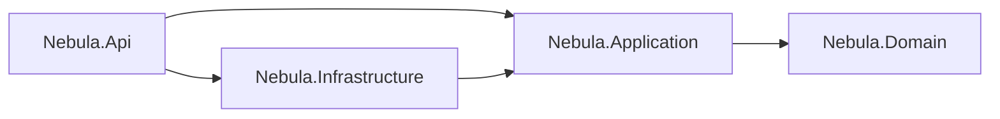

# Architecture notes

Short answers to "why is it built like this?". The goal was a backend that a client recognizes as
clean and production-minded, but that stays small enough to read in one sitting.

## Lean Clean Architecture

- **Domain** holds entities and enums only. No framework code, no dependencies.
- **Application** holds one service per feature (`OrdersService`, `ProductsService`, ...), the DTOs
  that define the JSON contract, FluentValidation rules and the analytics maths. It talks to data
  through `IAppDbContext` and gets time from `IClock`, so it is easy to test.
- **Infrastructure** implements those interfaces: EF Core `AppDbContext` for SQLite, entity
  configurations, the seeder and the reset services.
- **Api** is the composition root and the HTTP edge: Minimal API endpoint groups, auth, CORS,
  rate limiting, error mapping and OpenAPI. Endpoints are thin: parse input, call a service, return
  `TypedResults`.

Four projects are enough to keep the rules clear (the compiler stops Domain or Application from
using ASP.NET Core or SQLite) without spreading one feature over ten files.

## What was left out on purpose

- **No MediatR / CQRS.** A service method per use case is easier to follow and debug. With about
  twenty endpoints, a mediator only adds indirection.
- **No repositories over EF Core.** `DbSet` already is a repository and `DbContext` a unit of work.
  `IAppDbContext` exposes the sets directly, so queries stay in LINQ and can use projections,
  `AsNoTracking` and split queries. The trade-off: Application references the EF Core package
  (not the SQLite provider). For a project this size that is the simpler choice.
- **No AutoMapper.** DTOs are records with small hand-written mapping methods (`ToDto()`, `From()`):
  explicit, fast, and easy to search.
- **No Result/monad library.** Expected failures throw small `ApiException` types
  (`NotFoundException`, `ValidationFailedException`); one exception handler turns them into
  ProblemDetails. Unexpected exceptions become a generic 500 and go to the log only.

## Why SQLite that is re-created and re-seeded

This API backs a public portfolio demo, not a system of record:

- **Zero setup.** No database server to install, run or pay for; the whole app is one container.
- **Always a clean demo.** Visitors can edit and delete anything. The database is created on
  start, can be reset with `POST /api/demo/reset`, and resets itself every 6 hours.
- **Deterministic data.** The seeder is a port of the Angular mock's `seed.ts` with a fixed Bogus
  seed, so the dashboard shows the same shapes on the mock and on the live API, and tests can
  assert exact numbers.
- **Simple money maths.** Amounts are `decimal` in C# and stored as SQLite `REAL`, so sorting and
  sums run in the database; results are rounded to 2 decimals. Tests cover the mapping and totals.

Moving to SQL Server or PostgreSQL means changing the provider in Infrastructure and adding
migrations; Application and Api do not change.

## Contract first

The Angular app was built first against an in-browser mock. That mock is the specification:
filters, sort keys, defaults, clamps, analytics formulas, error codes and messages were ported
one to one. Integration tests compare real responses with the TypeScript models (property names,
`null` vs. missing fields, enum strings, ISO dates with `Z`), so the frontend works against both
backends without changes.

## Security choices

Sized for a public demo that has no real users but still runs on the internet:

- **JWT bearer auth** on every `/api` endpoint except sign-in. HS256, 8-hour tokens, the signing key
  comes from the environment and the app refuses to start with a missing or short key.
- **Demo sign-in** accepts any email with a 6+ character password, exactly like the frontend mock.
  There is one demo user and no stored passwords.
- **CORS allow-list** for the dashboard origins only.
- **Rate limiting:** fixed window of 120 requests per minute per client IP. Behind the proxy the
  real IP comes from `X-Forwarded-For`, trusted only from the known proxy address.
- **Input limits:** 64 KB request bodies, strict JSON (400 for broken JSON, 415 for other types).
- **No information leaks:** no `Server` header, no stack traces in responses, the trace id links
  an error to the log.
- **Container hardening:** chiseled runtime image (no shell), non-root user, read-only file system,
  all Linux capabilities dropped, memory and process limits, port bound to `127.0.0.1` so only the
  reverse proxy can reach it. TLS is terminated by the proxy.
