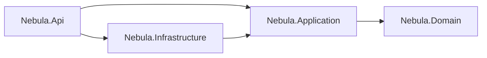

# Architecture notes

Short answers to "why is it built like this?". The goal was a backend that a client recognizes as
clean and production-minded, but that stays small enough to read in one sitting.

## Lean Clean Architecture

- **Domain** holds entities and enums only. No framework code, no dependencies.
- **Application** holds one service per feature (`OrdersService`, `ProductsService`, ...), the DTOs
  that define the JSON contract, FluentValidation rules and the analytics maths. It talks to data
  through `IAppDbContext` and gets time from `IClock`, so it is easy to test.
- **Infrastructure** implements those interfaces: EF Core `AppDbContext` for SQLite, entity
  configurations, the seeder and the reset services.
- **Api** is the composition root and the HTTP edge: Minimal API endpoint groups, auth, CORS,
  rate limiting, error mapping and OpenAPI. Endpoints are thin: parse input, call a service, return
  `TypedResults`.

Four projects are enough to keep the rules clear (the compiler stops Domain or Application from
using ASP.NET Core or SQLite) without spreading one feature over ten files.

## What was left out on purpose

- **No MediatR / CQRS.** A service method per use case is easier to follow and debug. With about
  twenty endpoints, a mediator only adds indirection.
- **No repositories over EF Core.** `DbSet` already is a repository and `DbContext` a unit of work.
  `IAppDbContext` exposes the sets directly, so queries stay in LINQ and can use projections,
  `AsNoTracking` and split queries. The trade-off: Application references the EF Core package
  (not the SQLite provider). For a project this size that is the simpler choice.
- **No AutoMapper.** DTOs are records with small hand-written mapping methods (`ToDto()`, `From()`):
  explicit, fast, and easy to search.
- **No Result/monad library.** Expected failures throw small `ApiException` types
  (`NotFoundException`, `ValidationFailedException`); one exception handler turns them into
  ProblemDetails. Unexpected exceptions become a generic 500 and go to the log only.

## Why SQLite that is re-created and re-seeded

This API backs a public portfolio demo, not a system of record:

- **Zero setup.** No database server to install, run or pay for; the whole app is one container.
- **Always a clean demo.** The database is created on start and resets itself every 6 hours.
  On the public instance visitor writes are never persisted at all (see below).
- **Deterministic data.** The seeder is a port of the Angular mock's `seed.ts` with a fixed Bogus
  seed, so the dashboard shows the same shapes on the mock and on the live API, and tests can
  assert exact numbers.
- **Simple money maths.** Amounts are `decimal` in C# and stored as SQLite `REAL`, so sorting and
  sums run in the database; results are rounded to 2 decimals. Tests cover the mapping and totals.

Moving to SQL Server or PostgreSQL means changing the provider in Infrastructure and adding
migrations; Application and Api do not change.

## Read-only demo

Every visitor shares one database, and the AI assistant reads that data through its tools. If
visitors could save data, anyone could add an offensive product name that every other visitor sees,
or plant text such as "ignore your instructions and ..." in a product description and so inject a
prompt into the assistant. So the public instance runs with `Demo:ReadOnly=true` (the default):

- **Dry runs, not 403s.** The dashboard should still feel fully interactive. A mutating request runs
  the real pipeline (auth, validation, business rules, id allocation) inside a database transaction
  that is rolled back after the handler has built its result. The response is exactly what a real
  write returns, including the created product with its next id, plus `X-Nebula-Dry-Run: true`
  (exposed through CORS so the Angular app can show a hint).
- **One endpoint filter on the mutating groups.** `WithDryRunWhenReadOnly()` on the Orders and
  Products groups wraps every non-GET endpoint in `IDryRunner`. The services do not know about the
  mode and keep calling `SaveChangesAsync`; EF Core enlists those saves in the open transaction. A
  filter was chosen over changing each service (easy to forget one) and over middleware (it would
  wrap the response writing and could not rely on endpoint metadata). Because it sits on the group,
  a new write endpoint in those groups is covered automatically, and an OpenAPI test fails if any
  mutating operation outside sign-in, AI and the live feed lacks the documented header.
- **One write lock, always taken first.** Every SQLite writer (dry runs, visitor writes when
  read-only mode is off, live orders, the demo reset) takes the app's `WriteGate` (a singleton,
  so one per app and database) before it touches the database. Writers therefore never wait on each
  other's SQLite write lock, so there is no lock-order deadlock and no `SQLITE_BUSY`; readers are not
  blocked thanks to WAL. The gate is re-entrant within one async flow, so `ProductsService.CreateAsync`
  (which takes it for id allocation) still works inside a dry run; re-entry is tied to the current
  hold, so work that outlives it cannot slip past. The rollback runs even if the client disconnects,
  and the change tracker is cleared afterwards, so nothing discarded can leak into the rest of the
  request; the `DbContext` is per request anyway. A reset re-inserts about 30k rows and holds the
  gate while it does, so writes arriving during a reset wait for it.
- **What still writes.** The live order feed and the periodic reset are generated by the server from
  seed data, so they are trusted and persist. `POST /api/demo/reset` becomes a no-op (visitors have
  nothing to undo), sign-in and `/api/ai` do not write. `GET /api/demo/mode` reports the mode.

Tests run with `Demo:ReadOnly=false` so they keep checking real persistence; a separate factory
covers the read-only behaviour of every write endpoint.

## Contract first

The Angular app was built first against an in-browser mock. That mock is the specification:
filters, sort keys, defaults, clamps, analytics formulas, error codes and messages were ported
one to one. Integration tests compare real responses with the TypeScript models (property names,
`null` vs. missing fields, enum strings, ISO dates with `Z`), so the frontend works against both
backends without changes.

## AI layer

The AI features are one more Application feature (`Nebula.Application/Ai`), not a separate stack:

- **`IChatClient` is the only seam.** `AiAssistant` depends on the `Microsoft.Extensions.AI`
  abstraction. Infrastructure builds the concrete client (DeepSeek through the OpenAI SDK with a
  custom endpoint) and wraps it in function invocation. Changing provider is a registration change;
  prompts, tools, quotas and tests stay the same.
- **Tools reuse the services.** `StoreDataTools` wraps `AnalyticsService`, `OrdersService`,
  `CustomersService` and `ProductsService` as read-only `AIFunction`s that return small records
  instead of full DTOs. The model can only read, and it reads the same numbers as the dashboard.
- **Recorded mode is the same data without the model.** Without a key, budget or a healthy provider,
  the suggested questions are answered by templates that call the same tool methods, so the demo
  keeps working and never shows made-up numbers.
- **Cost control lives in code.** A thread-safe in-memory counter (`AiQuotaTracker`, UTC day from
  `IClock`) caps live calls per client IP and globally; output tokens, tool round trips, input size
  and request time are capped too, and usage is logged per call. In-memory is enough for one
  container; several instances would move the counter to Redis or the database.
- **Why DeepSeek.** Cheap, OpenAI-compatible, supports tool calling and bills a prepaid balance, which
  is the last line of defence for a public demo. The model id (`Ai__Model`) is configuration.

## Security choices

Sized for a public demo that has no real users but still runs on the internet:

- **JWT bearer auth** on every `/api` endpoint except sign-in. HS256, 8-hour tokens, the signing key
  comes from the environment and the app refuses to start with a missing or short key.
- **Demo sign-in** accepts any email with a 6+ character password, exactly like the frontend mock.
  There is one demo user and no stored passwords.
- **CORS allow-list** for the dashboard origins only.
- **Rate limiting:** fixed window of 120 requests per minute per client IP, and a tighter 10 per
  minute on `/api/ai`. Behind the proxy the
  real IP comes from `X-Forwarded-For`, trusted only from the known proxy address.
- **Input limits:** 64 KB request bodies, strict JSON (400 for broken JSON, 415 for other types).
- **No information leaks:** no `Server` header, no stack traces in responses, the trace id links
  an error to the log.
- **Container hardening:** chiseled runtime image (no shell), non-root user, read-only file system,
  all Linux capabilities dropped, memory and process limits, port bound to `127.0.0.1` so only the
  reverse proxy can reach it. TLS is terminated by the proxy.
